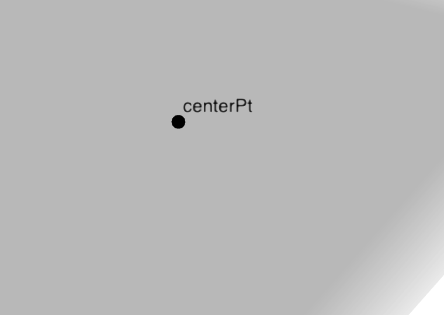
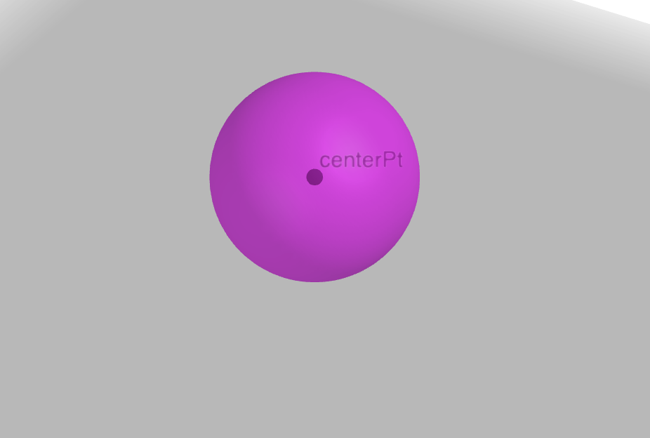
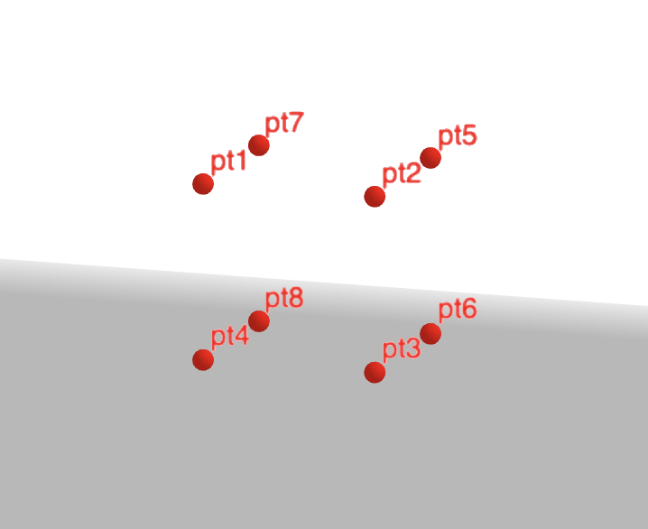
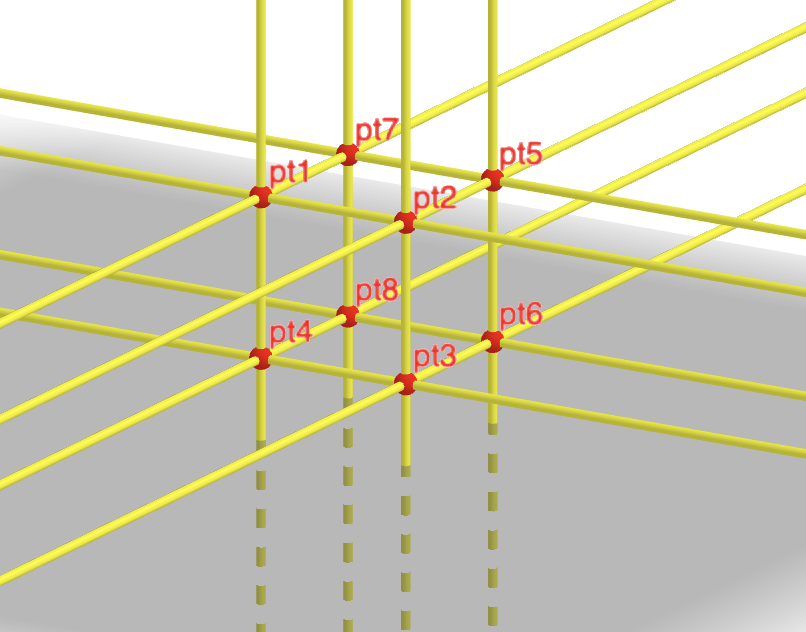
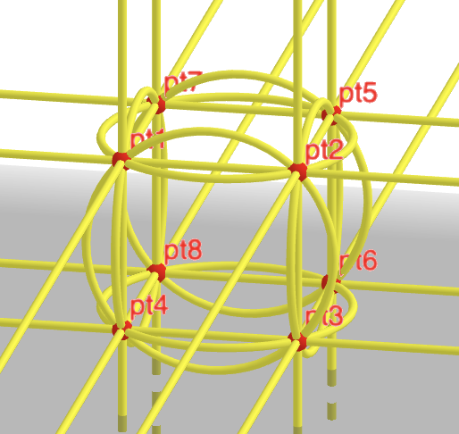
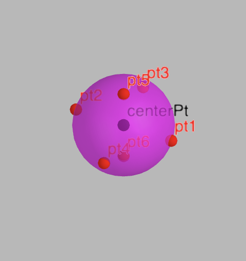
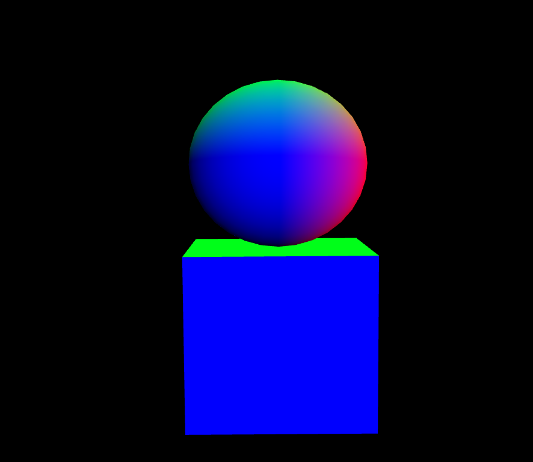
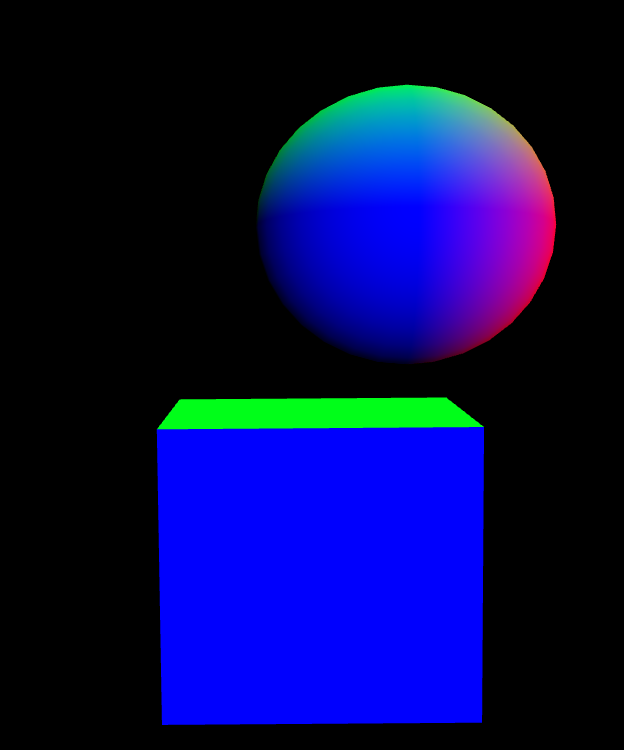

# Introduction

Le sujet traité est une simulation de collision en utilisant non pas de l'algèbre linéaire mais
de l'algèbre géométrique.

J'ai choisis d'utiliser des formes simples, une sphère et un carré, pour faire cette simulation.

# Construction des formes

## Sphère

La sphère est construite à partir d'un point. Ce point va nous servir de centre pour construire notre sphère.

On va ensuite appliquer la formule suivante sur ce point $u_c$ :

\begin{equation}
S^* = u_c - \frac{r^2}{2}e_\infty
\end{equation}

Avec $r$ le rayon de la sphère.

Lorsque l'on applique cette formule sur le point, on va obtenir une sphère dual ayant pour centre notre point.
On va ensuite dualiser cette sphère dual, ce qui va nous permettre d'obtenir une sphère "normal" que l'on
utilisera pour évaluer les collisions.

## Cube

Le cube est construit à partir de plusieurs points repésentant les sommets de ce dernier.

Ensuite on crée les lignes entre chaque points, lignes représentant les arêtes du cube.
Cela nous permet d'avoir une représentation d'un cube en c3ga.

Les points et les lignes servent à évaluer les collisions.

# OpenGL

## Modélisation

La modélisation des formes est effectuée avec OpenGL.

Le création des vertex de la sphère se font en fonction du centre donné avec c3ga.
Le cube est créé en (0, 0, 0) et pour chaque faces créées on effectue la création des sommets et lignes c3ga
correspondant.

## Déplacement

On dispose d'une caméra dite Freefly. Les déplacements sont effectuer avec glm, donc tout est géré sur
le GPU.

On aussi la possibilité de déplacer la sphère. Ce qui est intéressant pour le déplacement de la sphère
est que j'ai fais en sorte de ne pas utiliser la translation effectuée par glm.

À la place, j'effectue une translation à l'aide d'un translator et ensuite de je mets à jour les vertex
de la sphère en fonction de nouvelles coordonnées du centre de la sphère.

Cela me permet de montrer que l'on peut aussi faire des translations avec c3ga en OpenGL.

# Gestion de la collision

## Méthode de départ

L'interêt d'utiliser des lignes au début était de pouvoir les utiliser pour detecter une collision entre le cube et la sphère.
Lorsqu'une sphère intersecte une ligne, on obtient une paire de point réelle ou imaginaire.

Cependant je me suis vite rendu compte que cette technique allait être laborieuse à implémenter.
Comme les droites sont infinies, on doit tester chaque intersections entre la sphère et les lignes.
Et pour chacunes de ces intersections, il faut tester si chaque point de la paire
obtenue sont situés entre deux sommets du cube.
Mais il faut aussi gérer les cas où seulement un seul point se situe entre les deux sommets.

## Méthode utilisée

J'ai donc choisit de créer des cercles au niveau des faces du cube.

Cela nous permet de n'avoir à juste vérifier que l'inner product de la paire de points obtenue
est > 0 si la sphère intersecte une des cercles.

Cependant il nous reste un dernier problème qui est le cas où la sphère intersecte au millieu d'un cercle.
En effet, l'inner product ne nous permet pas de savoir si la sphère intersecte le cercle.

Pour remedier à cela j'ai donc décidé de rajouter des points aux extrémités de la sphère.

On doit alors comparer la paire de points qui est un point de la sphère et le centre du cercle visé en faisant
l'inner product avec le dit cercle.

J'ai construit les cercles de sorte que si le point de la sphère est dans le cube alors l'innert product est > 0

# Conclusion

Cette méthode pour détecter les collisions marche mais elle est loin d'être parfaite. En effet
si l'on regarde une collision avec le centre d'une face tout est en ordre.

Alors que lorsque l'on tente une collision à un autre point on peut se retrouver avec le resultat
suivant :

Cela vient du fait que les cercles des faces dépassent et donc on peut obtenir ce genre d'incohérence.
De plus la détection avec les points du cercle est une implémentation adapté à un carré.
Si l'on venait à changer de forme la méthode ne marcherait pas.

Une solution pour éviter les incohérences serait d'utiliser les lignes juste pour les arêtes du carré.